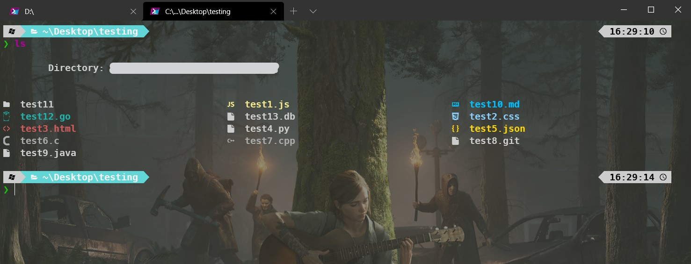
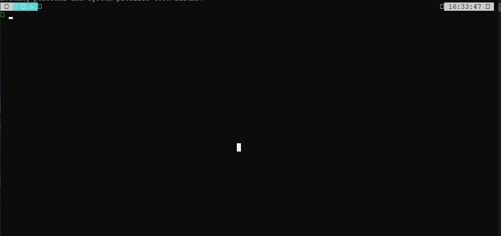
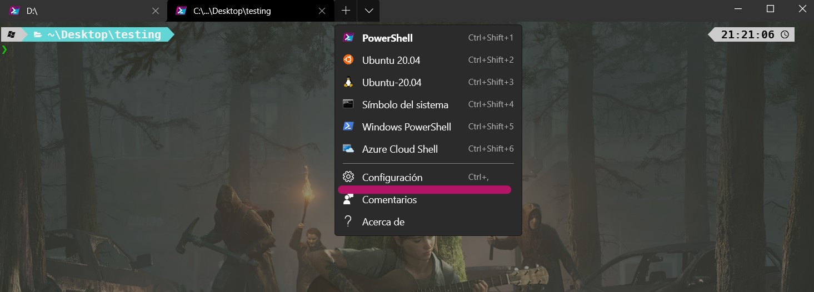
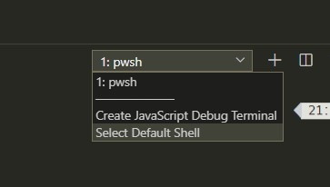

# PowerShell Configuration

My powershell configuration

- **Preview**

  At the end of this guide your terminal will be like this.
  

  - **Install Windows Terminal (Optional)**

  First of all, I recommend you install Windows terminal that could will allow you personalize your terminal even more. You can download it from the microsoft store.
  [https://www.microsoft.com/en-us/p/windows-terminal/9n0dx20hk701?activetab=pivot:overviewtab](Windows Terminal)

- **Install/Update Powershell (This is not strictly necessary but i recommend you install it if you can so you wouldnt have problems with any step)**

  Install the last version of powershell. You can download it from here. Remember that this version is going to replace the powershell 6 if you have installed it. (Does not affect powershell version 5)
  [https://github.com/PowerShell/PowerShell/releases](Download Powershell)

- **Install OhMyZsh for windows (OhMyPosh)**

  You need to use the PowerShell Gallery to install oh-my-posh. (Refered: https://github.com/JanDeDobbeleer/oh-my-posh) You can see the themes available there. But take into account that some themes dont have the same names that appear in the repository.

  Install posh-git and oh-my-posh:

  ```
  Install-Module posh-git -Scope CurrentUser
  Install-Module oh-my-posh -Scope CurrentUser
  ```

  Enable the prompt:

  ```
  # Start the default settings
  Set-Prompt
  # Alternatively set the desired theme:
  Set-Theme Agnoster
  ```

  In case you're running this on PS Core, make sure to also install version 2.0.0-beta1 of PSReadLine

  ```
  Install-Module -Name PSReadLine -AllowPrerelease -Scope CurrentUser -Force -SkipPublisherCheck
  ```

  To enable the engine edit your PowerShell profile:

  ```
  if (!(Test-Path -Path $PROFILE )) { New-Item -Type File -Path $PROFILE -Force }
  notepad $PROFILE
  ```

  In the file opened copy these lines so next times you open terminal it will load the modules and theme

  ```
  Import-Module posh-git
  Import-Module oh-my-posh
  Set-Theme Paradox
  ```

  Some Useful Commands:

  To see what are your actual settings:

  `$ThemeSettings`

  If you want to open the file that define your profile in powershell.

  `$profile`

  It gives you the path of your configuration profile path. You can open it with the command notepad or code if you have visual studio code.

  `notepad $profile`

  To see what are the names of the available themes:

  `get-theme`

  If you want to test some themes temporaly you can use the command:

  `Set-Theme NameofTheTheme`

  To see what are the actual colors of your theme:

  `Show-ThemeColors`

  To see what are the colors available that you can use:

  `Show-Colors`

  Remember that when you choose a theme and want to see it every time you start powersheel you have to define it in your profile file using

  `notepad $profile`
  Set-Theme NameOfTheme

- **Install Fonts**

  If you dont install the fonts you probably will see something like this:

  

  So, you should install a font that includes glyphs. Two of them are Cascadia Code PL or MeslolGS NF

  [MesloLGS NF Regular](https://github.com/romkatv/dotfiles-public/blob/master/.local/share/fonts/NerdFonts/MesloLGS%20NF%20Regular.ttf)
  You can install it with double click

  [Cascadia Code](https://github.com/microsoft/cascadia-code/releases)

  Now, to set the fonts in terminal:

  

  in that configuration file oyu have to add configuration for you default profile or specifically for your powershell 7

  

  Also, If you have want to use that version of powershell and set that font in vscode to use it in the terminal you could do this.

  - Pwshell as default shell

  

  Select the version 7 of powershell

  

  - add this lines in settings.json

  `"terminal.integrated.fontFamily": "MesloLGS NF"`

- **Sudo Command** (Optional)

  Also if you want to have the sudo command like in linux you should download an executable and save it in a folder in your pc and then add that folder in your environment variables path. (You can save that file in c:/Windows folder too. Taking advantage that it is in the environmental variable path) Well, this is optional, you always can change properties of powershell to force it open as administrador always. But, this would be necessary for you if you want to execute something as administrator in ps6 when you are coding in vscode. (You can solve that just open it as administrator too. haha.)

  [Sudo command](./sudo.rar)

- **Installing module for icons** (Referred: https://github.com/devblackops/Terminal-Icons)

To install the module from the PowerShell Gallery:

`Install-Module -Name Terminal-Icons -Repository PSGallery`

To use it modify your profile file adding this line:

`Import-Module -Name Terminal-Icons`

_Note: Take into account that this module can make it take a bit longer to start powershell._

You can see your file with icons using:

```
Get-ChildItem | Format-List

Get-ChildItem | Format-Wide

Get-ChildItem | Format-Wide -Column 3

```

**_Aditionally, if you want to use ls and la commands in powershell so you can see your files with icons easily you could add these lines in your profile file_**

```
#ALIAS

Set-Alias -Name l -value Get-ChildItem
Set-Alias -Name ls -value lsformatwide
Set-Alias -Name lsl -value lsformatlist

#FUNCIONES

function lsformatwide {
    Param(
        [switch]$la
    )

    if ($la) {
        Get-ChildItem $Args[0]. -Force  | Format-Wide -Column 3
    }
    else {
        Get-ChildItem $Args[0] | Format-Wide -Column 3
    }
}
function lsformatlist {
    Get-ChildItem | Format-List
}
```

_**Now you can use l,ls,lsl to get different views of your files. Also if you want to see hidden files you can use -la after ls**_

- **Some color personalization for Readline**

I have additional configuration for colorising the readline words adding these lines in my profile.ps1

```
Set-PSReadLineOption -Colors @{
    Command            = 'Magenta'
    Number             = 'DarkGray'
    Member             = 'DarkGray'
    Operator           = 'DarkMagenta'
    Type               = 'DarkCyan'
    Variable           = 'Green'
    Parameter          = 'DarkGreen'
    ContinuationPrompt = 'DarkGray'
}
```

- **If you want to use my theme that i have edited i am gonna to upload it soon after some modifications so you can easily change colors**
